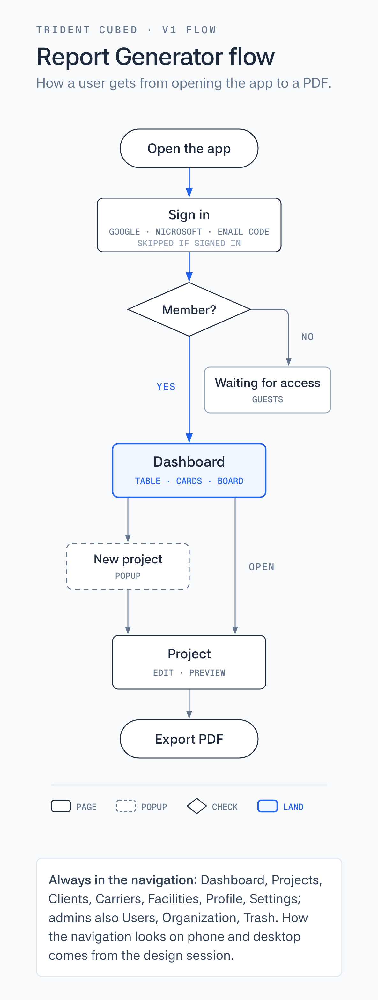

# Report Generator pages

The pages (routes) of the Report Generator: the end goal, and the part that ships in V1. Decided on "💬 app: Decide the V1 pages and how they connect" ([#159](https://github.com/layerdbiz/tridentcubed/issues/159)), 2026-10-10. How the pages look, and how the navigation behaves on a phone and a desktop, is decided by the design prototypes that follow.

## The pages

✅ = V1. Everything else is the end goal, built after V1.

- Anyone
  - Sign in ✅ (Google, Microsoft or an emailed code; ADR 0002)
    - Enter code ✅
  - Privacy policy ✅ (may live on the Website)
  - Terms ✅ (may live on the Website)
- Signed in
  - Waiting for access ✅ (what a Guest sees until an admin lets them in)
  - Dashboard ✅ (where Members and Admins land; in V1 it is the same list as Projects)
  - Projects ✅
    - Project ✅ (the Workspace)
      - Edit ✅
      - Preview ✅ (zoom, page layouts, Export PDF)
      - Photos
      - History
      - Sent copies
  - Clients ✅ (list only)
    - Client
  - Carriers ✅ (list only, filtered by vessel, airplane, train, truck)
    - Carrier
  - Facilities ✅ (list only)
    - Facility
  - Notifications
  - Search
  - Profile ✅
  - Settings ✅ (Install app, Sign out, Remove my data from this device; ADR 0007)
  - Help
- Admin
  - Users ✅
    - User
  - Organization ✅
    - Report templates
  - Trash ✅
  - Activity log
- Client portal
  - My projects
  - Request a report
- Super admin
  - Organizations
- Always there
  - Not found / error ✅

## How they connect

1. Opening the app goes to Sign in, skipped when already signed in.
2. A Member or Admin lands on the Dashboard; a Guest lands on Waiting for access.
3. From the Dashboard a User opens a project, or makes one with New project, a popup (title and client; whoever makes it is the Owner).
4. A project opens on its Workspace, Edit and Preview; Preview exports the PDF.
5. The navigation always reaches Dashboard, Projects, Clients, Carriers, Facilities, Profile and Settings; admins also reach Users, Organization and Trash.

## Rules

- **One list, three views.** Dashboard, Projects, Clients, Carriers, Facilities, Users and Trash are the same list component with different data. Table, Cards and Board (a column per project status) are all V1, and the User picks the view.
- **Clients, Carriers and Facilities get their own list pages** on top of being picked and added from dropdowns in the Project details panel (ADR 0005). A single Client, Carrier or Facility page comes later.
- **New project is a popup,** not a page.
- **No Welcome walkthrough in V1.** The phone asks for the camera, location or microphone the first time a feature needs it. A walkthrough at first sign-in stays on the list for later.
- **No Offline page.** Once signed in the app runs from the device (ADR 0007); opening it for the first time with no signal shows a message on Sign in.
- **Still open for the design prototypes:** what the navigation is on a phone (a bottom bar, a floating bar, or none, as in ChatGPT) and on a desktop (a slim icon rail), and whether a desktop shows Edit and Preview side by side as one screen, panels on the left and the live preview on the right.

The flowchart's source is [pages-flow.html](pages-flow.html).
